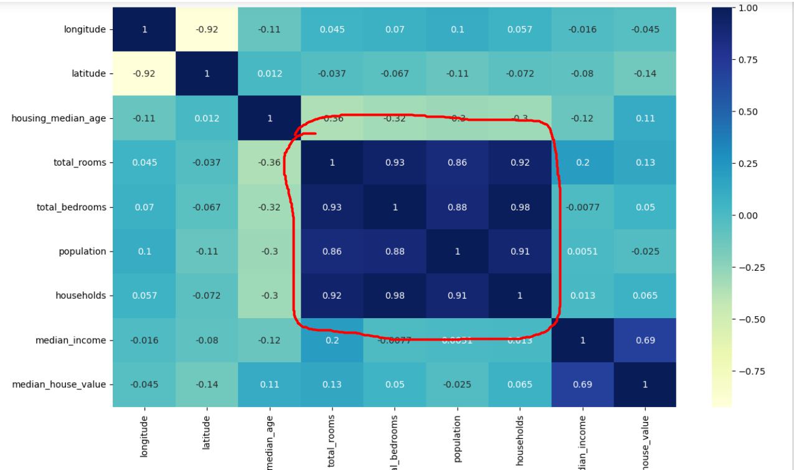
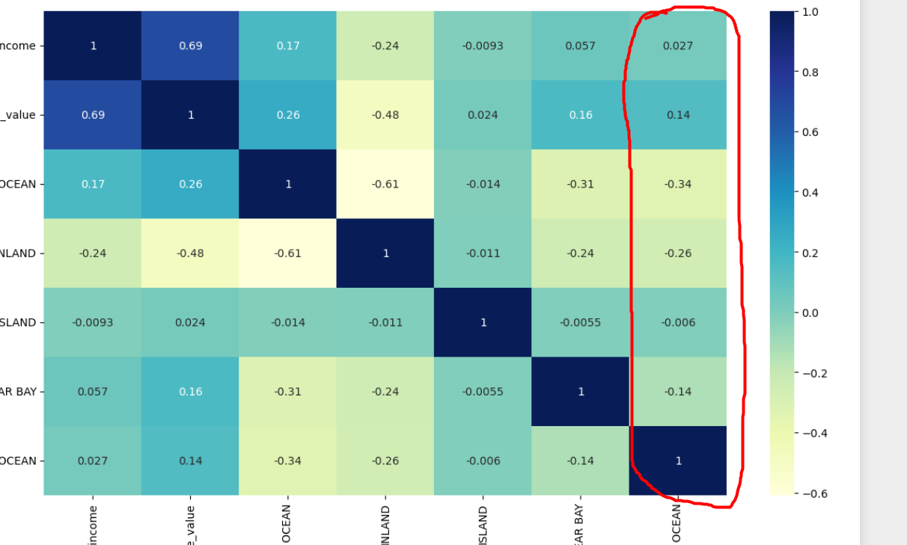
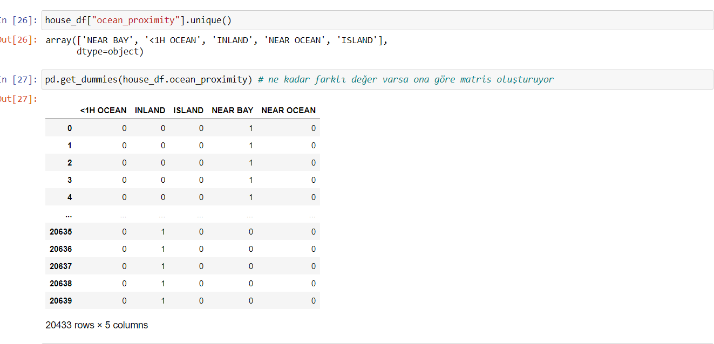
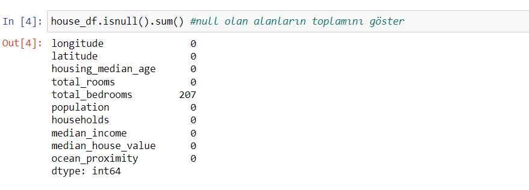
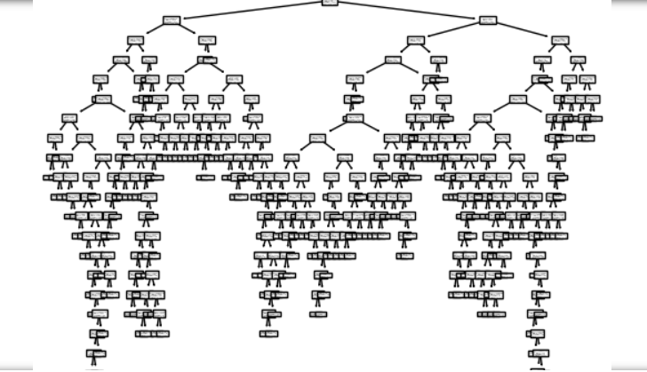
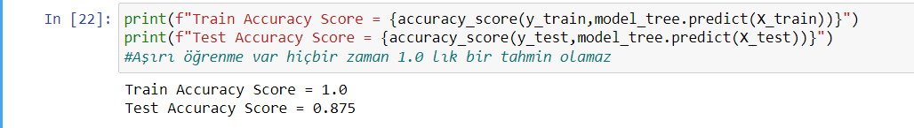

# Veri Madenciligi

### Not:

- Bu çalışma Süleyman Demirel Üniversitesi Bilgisayar Mühendisliği Veri Madenciliği dersinde öğrendiklerimiz ve kendi çalışmalarım sonucu oluşturulmuştur. Birçok hafta pandas kütüphanesi üzerinde detaylı anlatımdan oluşuyor.
- Son 3 haftada ise Lineer regresyon  ,sınıflandırma, kümelendirme yöntemlerini kullanarak makine öğrenmesi yardımıyla model oluşturup verileri tahmin ettirme ve modelin doğruluğunu ölçme işlemleri bulunuyor.
- pandas, scikit-learn, pyplot, seaborn, numpy kütüphaneleri kullanıldı.
- Çoğu işlemin ne yaptığının açıklamaları bulunuyor.
- Aşağıda Veri Madenciliğinde fazlaca kullanılan terimlerden bahsettim.

**Veri madenciliği:** büyük ölçekli veriler arasından faydalı bilgiye ulaşma, bilgiyi madenleme işidir. Büyük veri yığınları içerisinden gelecekle ilgili tahminde bulunabilmemizi sağlayabilecek bağıntıların bilgisayar programı kullanarak aranması olarak da tanımlanabilir.

### **Veri Madenciliği Adımları:**

**1. İşi Tanımlama (Business Understanding):**

Başlangıç olarak proje hedeflerini ve ihtiyaçlarını anlama ve bunu veri madenciliği tanımına dönüştürme aşamasıdır.

**2. Veriyi Anlama (Data Understanding):**

Bu aşamada veri toplama işlemiyle başlar, veri kalitesi problemlerini belirleme, veriden ilk görüleri çıkartma.. diye verinin probleme ne kadar çözüm getirdiğiyle devam eder.

**3. Veriyi Hazırlama (Data Preparation):**

Topladığımız veriden veri seçme, veri temizleme, veri dönüştürme… gibi model uygun son veri setini elde etmek için yapılan işlemlerdir.

**4. Modelleme (Modeling):**

Bu aşamada çeşitli modelleme tekniklerinin ve algoritmalarının seçilmesi, parametrelerin seçilmesi ve uygulama işlemleri gerçekleştirilir.

**5. Değerlendirme:**

Bu aşamada oluşturulan modelin deneme ve gözden geçirilmesi yapılır, gerekiyorsa iyileştirmeler yapılır.

**6. Uygulama:**

Son aşamada ise modelin analistlere ve son kullanıcılara sunulup iş süreçlerinde kullanılacak hale getirilir.

### Veri Madenciliğinde Modelleme Seçenekleri:

1. Lineer Regresyon: Doğrusal regresyon, ilgili ve bilinen başka bir veri değeri kullanarak bilinmeyen verilerin değerini tahmin eden bir veri analizi tekniğidir.
2. Sınıflandırma Analizi: Bir veri veya veri grubunun mevcut sınıflardan hangisine ait olduğunun belirlenmesi olarak tanımlanmaktadır
3. Kümeleme Analizi: Belli özellikte verilerin benzer özelliklerine göre en doğru kümelere bölünmesi işlemidir.

### Veri Madenciliğinde kabul edilmiş evrensel değişkenler:

Giriş değişkenleri(X) modelimizi eğittimiz ve test ettiğimiz verilerden oluşurken çıkış değişkeni(y) modelimizin tahmin ettiği değerlerdir. X ve y değişkenlerini bu sebeple kullanıyoruz.Giriş   değişkenileri çıkış Değişkenini tahmin ederler.

- GirişDeğiskeni()-Çıkış.Değişkeni()
- Input-Output
- Independent-dependent
- X-y

### Modelimizi Eğitirken Dikkat Edeceğimiz Bazı Durumlar

1. **Giriş Değişkenleri Arasındaki Yüksek Korelasyon:**

Yukarıda görüldüğü üzere giriş değişkenleri arasında yüksek korelasyon vardır(1 e yakın olması durumu) ve modelimizi eğitirken biz giriş değişkenleri arasında yüksek korelasyon istemeyiz.Bu sorunu çözmek için yüksek korelasyon bulunan giriş değişkenlerinden sadece 1 tanesi tutar diğerlerini sileriz.

2. **Giriş Değişkenlerinin Çıkış Değişkeni İle Düşük Korelasyona Sahip Olması:** Giriş değişkenlerinin çıkış değişkeni ile arasında ne kadar yüksek korelasyon varsa modelimiz o kadar iyi bir tahminde bulunur.

3. **Sözel veriler:** Sözel verileri veri madenciliği adımında kullanamıyoruz bu yüzden sözel verileri çevirebiliyorsak sayısal verilere çevirmeliyiz.

4. **Null veriler:** İçi boş verileri duruma göre silmeli ya da ortalama veya medyan ile doldurmalıyız eğer min max değerleri arasında fark çoksa silmemiz daha doğru olur.

5. **Aşırı Öğrenme:** Aşırı öğrenme modelimizin giriş değişkenlerinin çıkış değişkenleri ezberlemesidir %100 doğru tahmin etmesi iyi bir şeymis gibi gözüksede yeni veriler geldiğinde modelimiz çuvallatayacaktır sadece eğittimiz değişkenlerle çıkış değişkenlerini doğru tahmin eder. Aşırı öğrenmeyi engellemek için modelimizi budamamız gerekmektedir.

kaynak:

1-[https://aws.amazon.com/tr/what-is/linear-regression/](https://aws.amazon.com/tr/what-is/linear-regression/)

2-[https://furkanalaybeg.medium.com/veri-madenciliği-ve-yöntemleri-d0e2fd238e44](https://furkanalaybeg.medium.com/veri-madencili%C4%9Fi-ve-y%C3%B6ntemleri-d0e2fd238e44)
3-[Daha iyi notlar için :)](https://github.com/zehracakir/VeriMadenciligiNotlarim)